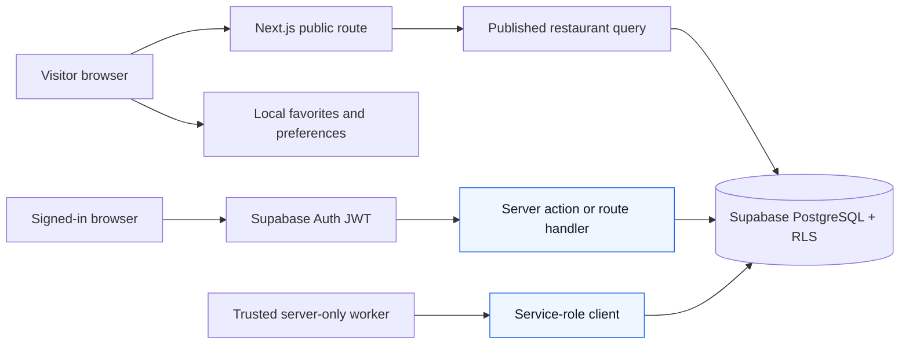
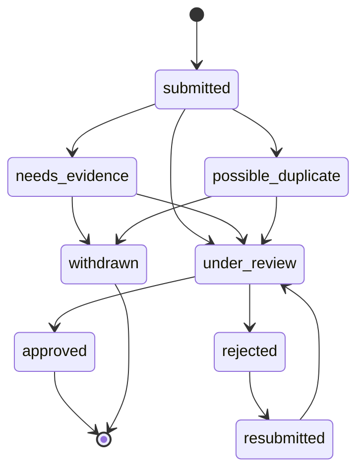

# Jeddah Restaurant Search — Product, Backend, and Development Workflow

## 1. Current baseline and planning boundary

This is a planning document for a guest-first restaurant discovery product in Jeddah. The repository currently has a minimal Next.js App Router foundation only. No Supabase project, database schema, authentication, production analytics, SEO routes, or restaurant features exist yet.

This document makes those future decisions explicit so that the first implementation slice is useful rather than merely technically impressive. “Must” statements below are acceptance criteria for future work, not claims about the present codebase.

### Product decision rule

The common journey is: arrive from Google, social media, or a shared link; find a restaurant quickly; examine a few results; perhaps save or share one; then leave without creating an account. Every proposed feature must answer:

- What immediate problem does it solve, and why would a visitor use it now?
- How many steps and how much data does it require?
- Does it work without authentication and on a slow mobile connection?
- What value remains if the visitor leaves halfway through?
- What would make the visitor return?
- What privacy, abuse, maintenance, or abandonment risk does it introduce?

The product should improve restaurant decisions, not recreate a social network.

## 2. Staged backend feature priorities

| User problem | Proposed capability | Expected frequency | User value | Technical difficulty | Data dependency | Abuse/privacy risk | Recommendation | Reason |
| --- | --- | --- | --- | --- | --- | --- | --- | --- |
| “I need somewhere suitable now.” | Fast bilingual search, filters, restaurant detail pages, directions/contact links | Very high | Very high | Medium | Accurate restaurant/branch data | Low | MVP | The primary search-to-decision path must work before advanced engagement features. |
| “I want to remember this place.” | Guest-first local favorites | High | High | Low | Stable restaurant IDs/slugs | Low | MVP | Delivers immediate value without account friction. |
| “I cannot choose among many options.” | Deterministic “Help me choose” shortlist | High | High | Medium | Opening hours, location, price/cuisine/venue attributes | Low | MVP after core catalogue | A small explainable shortlist reduces decision time more than another CRUD dashboard. |
| “Is this open and close to me?” | Branch-aware open-now and proximity queries | High | High | Medium | Reliable branch hours and coordinates | Medium if location is over-collected | MVP once data is trustworthy | Directly improves a time-sensitive decision; uncertainty must result in “hours unavailable,” not a guess. |
| “Search did not understand Arabic/English spelling.” | Bilingual full-text, aliases, typo-tolerant ranking | High | High | Medium | Names, dishes, neighbourhoods, aliases | Low | MVP | Important local differentiation and a strong PostgreSQL use case. |
| “This information might be wrong.” | Lightweight incorrect-data report, freshness metadata, review queue | Medium | High | Medium | Source attribution, moderation capacity | Medium | Version 1 | Build after enough catalogue traffic exists to generate trustworthy feedback. |
| “Show me things I may like.” | Local-only preference signals and recently viewed items | Medium | Medium | Low | Client state | Privacy risk if over-collected | Version 1 | Start locally; server tracking requires clear product questions and retention limits. |
| “What is popular right now?” | Transparent first-party trending score | Medium | Medium | High | Sufficient legitimate events | Bot and privacy risk | Version 1 | Useful only once traffic produces enough signal; explain it clearly. |
| “Find a hidden gem.” | Evidence-based underrated score | Medium | Medium | High | Sufficient impressions, saves, directions | Manipulation risk | Future | Needs volume and confidence thresholds; labels would be misleading early. |
| “Help our group decide.” | Expiring shareable shortlist with votes | Medium | High | High | Catalogue and short-link infrastructure | Link guessing, spam, privacy | Version 1 | Solves a real group decision problem without relying on restaurant-owner adoption. |
| “Add this missing restaurant.” | Submission, duplicate detection, and moderation | Low initially | Medium | High | Moderator time, source evidence | Spam and legal/data-quality risk | Future / demand-triggered | A supporting intake channel, not the early product’s main backend feature. |
| “Keep my saves across devices.” | Optional account favorites sync and recovery | Medium | Medium | Medium | Auth and account favorites table | Account/security risk | Version 1 | Present it only after a user has received value from guest saves. |
| “Owners should manage listings.” | Restaurant-owner claims | Low | Medium | High | Ownership verification process | Fraud and operational cost | Future | Requires a well-defined verification and support model. |

### MVP order

1. Build a verified, searchable branch catalogue and server-rendered public restaurant pages.
2. Add local favorites, bilingual search, useful filters, safe directions/contact actions, and an explicit “data unavailable” state.
3. Add deterministic shortlist ranking and branch-aware open-now/proximity only for records that have sufficient data.
4. Measure whether people decide faster, save restaurants, return to saves, and encounter no-result searches.

Do not start restaurant submissions, anonymous server identities, personalized server recommendations, trending, or social/review mechanics until the preceding evidence makes their cost worthwhile.

## 3. Guest favorites and optional account-sync decision

### Decision

Use **versioned `localStorage` as the default, local-first guest favorites store**. Use a server-side `account_favorites` table only for a signed-in user’s cross-device collection. On sign-in, invoke an authenticated, transactional, idempotent merge operation and retain local data until the application confirms success.

This is the simplest reliable first architecture that still leaves room to demonstrate useful backend engineering through RLS, a database function, constraints, transactions, and authorization tests. It intentionally does **not** create a server identity for every visitor.

| Option | Benefits | Costs and failure modes | Decision |
| --- | --- | --- | --- |
| `localStorage` | Synchronous, dependency-free, available before backend setup, naturally persists across deploys on the same browser/device | Small quota, user/browser can clear it, no cross-device sync, synchronous API | Use for a compact favorites index and lightweight preferences. |
| IndexedDB | Larger quota, asynchronous, appropriate for large offline catalogues/search indexes | More code, migration complexity, no added value for a few hundred favorite IDs | Defer. Reconsider for a deliberately offline-capable cached catalogue. |
| Generated device/guest ID | Can rate-limit or associate server events without Auth | Becomes tracking infrastructure; clearing storage changes identity; needs consent/retention work | Do not use for favorites. Consider a rotating, privacy-reviewed analytics identifier only if needed. |
| Supabase Anonymous Auth | Gives each device an authenticated `auth.uid()` usable by RLS | Account accumulation, rate limits/CAPTCHA, recovery loss after storage clear, more Auth lifecycle work | Do not use in MVP solely for saves. Evaluate later only if a guest server-side feature genuinely needs per-guest authorization. |
| Hybrid local-first + server sync | Immediate guest saves plus optional account backup | Requires merge and conflict handling | Use, but the server half starts only when the person opts into an account. |

### Local schema, limits, and migration

Store only a small index, never a cached restaurant record. A version-1 value at the single key `jrs:favorites` is conceptually:

```json
{
  "version": 1,
  "updatedAt": "2026-07-14T12:00:00.000Z",
  "favorites": {
    "restaurant-uuid": {
      "savedAt": "2026-07-14T11:45:00.000Z",
      "lastKnownSlug": "example-restaurant"
    }
  }
}
```

- The restaurant UUID is the canonical key. The slug is only a display/recovery hint because it can change.
- Saving an existing ID is a no-op: preserve its original `savedAt` rather than creating duplicates or moving it to the top unexpectedly.
- Cap favorites at 500 records (far below common browser quotas); report a clear, non-destructive “remove a saved restaurant to add another” message if that limit is reached. A 500-record JSON index is normally well below 1 MB, but quota exceptions must still be handled.
- Parse in a `try/catch`, validate that the version is supported and each entry has a valid UUID/timestamp shape, and discard only invalid entries. If the root value is corrupt, back it up under a diagnostic key with a short expiry if possible, reset to an empty v1 value, and show a quiet recovery notice rather than crashing.
- Migrate old versions with pure, tested functions. Write the new value only after migration succeeds; leave malformed data untouched until the recovery path is chosen. Keep migrations small and idempotent.
- Treat browser privacy restrictions, quota exceptions, third-party/embedded contexts, and private browsing as normal failures. If storage is unavailable, saves must fail honestly with a retryable message; do not pretend they will persist.
- Private/incognito mode may clear saves when the private session closes. Clearing browser data cannot be recovered without a signed-in backup. A deployment does not normally clear same-origin local storage, but changing domain/origin does.
- A guest collection cannot sync to another device without an account. State that plainly when offering the optional upgrade.

### Cross-tab, offline, and changed-record behavior

- Update in-memory UI immediately after a successful write. Synchronize other tabs with the `storage` event and `BroadcastChannel` when available; reconcile by canonical ID and earliest `savedAt`.
- Favourites work offline because writes are local. Restaurant cards still require cached or network data; show an offline/failed-record state rather than stale invented detail.
- Fetch current restaurant data by ID in batches when the saved list opens. A missing, deleted, unpublished, or inaccessible restaurant is retained as an “unavailable saved restaurant” row with a remove action; it must not expose a hidden record. If an approved redirect maps an old slug to a new public slug, update the hint after resolving the public record.
- Never use a slug as the favorite’s identity. Handle deleted records gracefully and never silently remove a user’s entry solely because a network request failed.

### Guest-to-account merge

```mermaid
sequenceDiagram
    participant B as Browser local favorites
    participant A as Supabase Auth
    participant N as Next.js server action/API
    participant D as PostgreSQL transaction

    B->>A: User optionally signs in or creates account
    A-->>B: Authenticated session (auth.uid)
    B->>N: Submit versioned local favorite IDs + idempotency key
    N->>D: Validate session, IDs, and published restaurants
    D->>D: Insert missing account favorites; retain earliest saved_at
    D->>D: Record merge key and result atomically
    D-->>N: Added, already-synced, unavailable counts
    N-->>B: Honest merge result
    B->>B: Mark local set synced only after confirmed success
```

Plain-language explanation: the browser continues to own its guest list. After a person explicitly signs in, the server merges only the submitted restaurant IDs into that person’s account collection in one transaction. Retrying the same merge cannot duplicate favorites or overwrite a previously earlier save date.

The future merge operation must:

1. Require an authenticated non-anonymous account unless a deliberate anonymous-auth linking design is adopted later.
2. Accept a bounded, validated list (at most 500 UUIDs), ISO timestamps, and a client-generated idempotency key. Do not trust a submitted user ID.
3. Resolve IDs server-side and only merge restaurants currently permitted to be saved. Return unavailable IDs as counts or client-safe IDs; never leak drafts or soft-deleted details.
4. In one transaction, lock or create a per-user merge receipt keyed by `(user_id, idempotency_key)`, upsert `account_favorites` using the unique `(user_id, restaurant_id)` constraint, and set `saved_at` to the earliest valid timestamp. Existing account-only favorites remain untouched.
5. Store a completed result for the idempotency key. A retry returns the same result; an in-progress conflicting request waits or returns a retryable state. Any validation or database error rolls back all inserts and leaves the local list intact.
6. Explain the outcome: for example, “12 saves backed up, 3 already in your collection, 1 restaurant is no longer available.” Never promise a failed merge succeeded.
7. Test the transaction for overlap, duplicates, retries, invalid IDs, hidden restaurants, RLS enforcement, and a simulated mid-transaction failure.

### Why not Anonymous Auth for MVP?

Supabase Anonymous Auth creates an actual anonymous user in `auth.users` and a signed JWT. It therefore gives the request a unique `auth.uid()` that RLS can use. That is fundamentally different from Supabase’s `anon` database role, which is a shared role used for unauthenticated requests and does not identify a person.

Anonymous Auth could later authorize private server-side guest lists or sync-like guest state. A permanent sign-in can link an anonymous identity to a permanent account, but the exact linking flow must follow current Supabase documentation and be tested for identity takeover. It is not free complexity: anonymous sign-ups need rate limits, possible CAPTCHA, abuse monitoring, retention/cleanup of abandoned identities, and a clear result when browser storage/session tokens are cleared. It also does not recover data after clearing storage unless the anonymous identity can be safely restored. For local favorites alone, it adds friction and operational risk without corresponding user value.

## 4. Proposed Next.js and Supabase architecture

### Request boundary



Plain-language explanation: public restaurant reads use a least-privilege public path constrained by RLS. Guest saves are browser-local. User-private operations carry an authenticated JWT so PostgreSQL can evaluate `auth.uid()`. A service-role client is restricted to server-only, narrowly audited tasks such as scheduled aggregation or moderation tooling; it is never sent to the browser.

### Core data model to implement through migrations

The exact names may change, but migrations should establish these explicit responsibilities:

| Area | Main records and important constraints |
| --- | --- |
| Identity | `profiles` keyed by `auth.users.id`; `user_roles` keyed by user ID with protected role assignments (`user`, `moderator`, `admin`). A user must not be able to edit their own privilege. |
| Restaurant catalogue | `restaurants` with immutable UUID, stable public slug history/redirect mapping, publication status, soft-delete timestamp, source and verification fields; `restaurant_branches` with coordinates, timezone, current contact/location facts; `branch_hours` and `branch_hour_exceptions`. |
| Search | Restaurant/branch search document or maintained normalized columns for Arabic, English, transliteration, aliases, dishes, cuisines, and neighbourhoods. Use only maintained data in ranking. |
| Private user data | `user_preferences`, `account_favorites` (unique user/restaurant), `swipes`, and optionally bounded/expiring `search_history`. |
| Trust and moderation | `restaurant_reports`, `restaurant_submissions`, `moderation_actions`, append-only `audit_logs`, verified source records, and approved slug redirects. |
| Discovery and analytics | Privacy-minimized `analytics_events`, aggregated time buckets, `trending_scores`, and transparent score inputs—not raw events in public responses. |
| Collaboration (Version 1) | `share_lists`, `share_list_items`, and `share_votes`, with unguessable tokens, expiry, deletion, no-indexing, and rate limits. |

### Constraints, functions, triggers, and jobs

- Use foreign keys and `NOT NULL`, `CHECK`, unique, and exclusion-like constraints where they express data truth: valid status enum, non-negative price band, latitude/longitude ranges, unique normalized slug, unique favorite, and valid report/submission state transitions.
- Use a SECURITY DEFINER database function only for carefully audited multi-row operations such as the favorites merge. Pin its `search_path`, fully qualify objects, revoke default execution, grant only the intended API role, validate `auth.uid()`, and write focused tests.
- Use a transaction for merges, moderation state changes plus audit entries, and any operation where partial success would misrepresent truth.
- Avoid triggers by default. A justifiable trigger might append an immutable audit record when a moderation action changes status; document actor, old/new values, and recursion safeguards. Application-maintained `updated_at` alone does not justify a complex trigger unless the project adopts a consistent database convention.
- Scheduled jobs should aggregate a bounded event window into trending scores and flag high-traffic stale records. Make jobs idempotent by bucket/run key, retain run telemetry, and use a server-only worker with minimal privileges.

### Search, proximity, and hours plan

1. Normalize Arabic and English strings (Unicode normalization, case-folding where meaningful, whitespace/punctuation cleanup) without destroying the original display value. Maintain aliases for transliterations, common misspellings, dishes, neighbourhood names, and curated synonyms.
2. Start PostgreSQL search with a weighted `tsvector` using the `simple` configuration plus explicit normalized aliases, because PostgreSQL does not provide an automatic Arabic linguistic solution by default. Add `pg_trgm` indexes for typo/fuzzy candidate matching. Weight exact normalized name/alias hits above prefix, full-text, and fuzzy matches; popularity is a secondary tie-breaker only.
3. Return a safe fallback (“No strong match; browse cuisine or neighbourhood”) rather than a false exact result. Log no-result queries only under the privacy policy and with a short retention period.
4. Store branch geography as PostGIS `geography(Point, 4326)` if proximity is a core filter, with a GiST index. Otherwise begin with validated coordinates and introduce PostGIS only when real queries require it. Use `EXPLAIN (ANALYZE, BUFFERS)` against realistic data before and after each index.
5. Store IANA timezone `Asia/Riyadh` per Jeddah branch anyway, not a browser offset. Evaluate opening intervals in branch local time. For intervals crossing midnight, treat the end as the following local day. Apply date-specific exceptions/temporary closures before regular hours. If hours are missing, stale, or conflict, show “Hours unavailable” / “Check before visiting,” never “Open now.”
6. Make the first decision engine deterministic: filter hard constraints first, score normalized matches for distance/travel band, open status, price, cuisine/craving, group context, seating, dietary needs, and optional adventurousness. Return at most a few results and an evidence-based reason for each. Do not introduce machine learning before the event volume and evaluation criteria justify it.

## 5. RLS and authorization design

### Roles and non-negotiable rules

| Actor | Database request identity | Intended capability |
| --- | --- | --- |
| Public visitor | `anon` database role, no authenticated user ID | Read only public, published, non-deleted material through approved tables/views. |
| Anonymous Auth user (not MVP) | `authenticated` role with anonymous JWT and unique `auth.uid()` | Only explicitly designed guest-private rows; not equivalent to a permanent account. |
| Registered user | `authenticated` role with `auth.uid()` | Their own private data and narrowly defined authored content. |
| Moderator | `authenticated` plus server-verified protected role | Least-privilege moderation queue and actions. |
| Admin | `authenticated` plus server-verified protected role | Administrative operations defined by audited policies/functions. |
| Trusted server worker | Server-only service role | Exception path for scheduled/admin tasks; bypasses RLS and must be minimized, audited, and never exposed. |

`anon` is a PostgreSQL role, not a unique guest user. Never treat it as identity, store a per-person favorite under it, or expect `auth.uid()` to distinguish ordinary visitors. RLS must be enabled on every exposed table; policies are additive, and all paths must be tested.

### Authorization matrix

Policy expressions below are design-level expressions, not deployed SQL. `is_moderator()` and `is_admin()` must be secure server-side/database functions that read a protected role source; they must not consult client-editable `profiles` data. “Own” means `user_id = auth.uid()` or appropriate immutable author/owner column. Every policy must also ensure referenced restaurant/branch data is publicly visible when it appears in a public-facing relation.

| Protected resource | Operation / applicable role | `USING` condition | `WITH CHECK` condition | Ownership rule | Expected allow | Expected deny | Required authorization tests |
| --- | --- | --- | --- | --- | --- | --- | --- |
| `profiles` | Select/update: authenticated user; staff only through approved admin path | `id = auth.uid()` for self; protected staff predicate for staff | `id = auth.uid()` and no mutable privilege fields | Profile ID equals Auth user ID | User reads/edits safe own fields | User reads another profile or changes role/ID | Self read/update succeeds; cross-user select/update and role escalation fail. |
| `user_roles` | Select: self only if necessary; write: admin/service only | `user_id = auth.uid()` for self read, or `is_admin()` | `is_admin()` only | Role grants are staff-owned | User can see their allowed role indicator | User assigns/removes any role including own | Role read scope; attempted self-promotion; moderator cannot grant admin. |
| `user_preferences` | All CRUD: authenticated | `user_id = auth.uid()` | `user_id = auth.uid()` | Immutable owner on insert/update | Own preference CRUD | Cross-user access; owner reassignment | Own CRUD; update payload changing owner; other-user operations. |
| `account_favorites` | Select/delete: authenticated; insert/update through constrained API/RPC | `user_id = auth.uid()` | `user_id = auth.uid()` and referenced restaurant is eligible | One user owns one favorite | Own favorite list/save/remove | Other-user favorite access; saving hidden restaurant; owner swap | Duplicate insert, direct malicious owner update, hidden ID, merge RPC retry. |
| `swipes` | Own CRUD/append: authenticated; guest signals local by default | `user_id = auth.uid()` | `user_id = auth.uid()` and restaurant eligible | User owns decision signal | Own rows and approved inserts | Other-user signals, draft reference, owner swap | JWT A vs JWT B; malformed event; hidden restaurant. |
| `search_history` | Own CRUD if retained: authenticated | `user_id = auth.uid()` | `user_id = auth.uid()` | User owns private history | Own history/reset | Other-user reads or bulk extraction | Read/delete own; cross-user; retention job only server side. |
| `reviews` | Public select only for approved review on public restaurant; own create/update while eligible; moderation by role | Public: `status = 'published' AND restaurant_is_public(restaurant_id)`; owner/staff alternatives | Author is `auth.uid()`, restaurant public, allowed editable status/content; staff predicate for moderation | Author fixed after insert | Public reads published; author edits eligible own draft | Reading rejected/private review; author changes author/status; draft restaurant leak | Public vs owner vs moderator select/update; forged status; related hidden restaurant. |
| `restaurant_reports` | Insert: public/authenticated rate-limited endpoint; select/update: reporter only if product permits, staff only | Reporter own if exposed; `is_moderator()` / `is_admin()` | Reporter identity set by server/JWT; target is public; no moderation fields from reporter | Reporter/staff owned | Visitor submits minimal report; staff handles queue | Public list of reports; reporter sets resolution; report on hidden target | Anonymous abuse/rate-limit path; report visibility; malicious status update. |
| `restaurant_submissions` | Authenticated create/read own; moderators administer | Own or staff predicate | Submitter equals `auth.uid()`, initial state only, bounded fields | Submitter fixed | Submitter creates/views own item | Public sees queue; submitter self-approves; cross-user access | State forgery; cross-user select/update; duplicate/evidence validation. |
| `restaurant_owner_claims` | Authenticated create/read own; assigned staff process | Own or staff predicate | Claimant equals `auth.uid()`, initial state only | Claimant fixed | Claimant files/views own claim | Others see evidence; claimant verifies self | Document storage and row policies; role abuse; state transition audit. |
| `restaurants` / `restaurant_branches` | Public select: anon/authenticated; staff write | `status = 'published' AND deleted_at IS NULL` for public; staff predicate separately | Staff predicate; status changes through audited workflow | Catalogue staff-owned | Public reads public facts | Draft/rejected/soft-deleted rows or columns; client status change | Public direct select and join attempts; slug redirect; staff scope. |
| Draft/rejected source data | Select/write: assigned moderator/admin only | Protected role plus assignment where used | Protected role and valid transition | Staff-managed | Assignee sees necessary queue detail | Public and unrelated moderator access | Direct base-table and related-table leak tests. |
| Restaurant photos metadata | Public select only when linked to public restaurant and public asset; staff write | `restaurant_is_public(restaurant_id)` or staff predicate | Staff controls link/status | Catalogue/staff owned | Public sees published photo metadata | Draft photo metadata via joins | Photo relation query with hidden restaurant; status forgery. |
| Public restaurant Storage bucket | Read: public only for published asset path; write/delete: staff/server only | Bucket/path maps to public asset | Staff/server validation and allowed MIME/size/path | Staff-owned paths | Public loads published image | Upload/replace/list unpublished path | Direct object URL, list, upload, traversal-like path, MIME checks. |
| Private evidence Storage bucket | Read/write: claimant/submission owner where needed and assigned staff; no public | Owner/assigned-staff path predicate | Owner path and allowed pending state; staff predicate | Claimant owns own evidence | Owner uploads allowed evidence; staff reviews | Public listing/download; one claimant accesses another | JWT A/B path tests; expired/rejected claim; signed URL handling. |
| `moderation_actions` | Insert/select: moderator/admin only; no public update/delete | `is_moderator()` or `is_admin()` | Actor equals `auth.uid()`, valid action and target | Actor immutable | Staff views/actions within scope | User action, actor forgery, history rewrite | Moderator vs user; action immutability; scope assignment. |
| `audit_logs` | Select: admin/auditor only; insert: trusted database function/trigger or server role; no update/delete | `is_admin()` / auditor predicate | Direct client insert denied; controlled writer validates actor | Append-only system record | Authorized audit review | Public/user mutation or deletion | Attempt all direct writes; function audit entry; staff read scope. |
| `analytics_events` | Insert: controlled ingestion endpoint/function; raw select: admin/analyst only; no client update/delete | Protected analyst predicate | Ingestion validates event schema, rate limit, and privacy fields | Server-generated identity/bucket | Valid event accepted once | Raw public reads, arbitrary properties, updates | Duplicate/rate-limit/bot cases; prohibited PII; analyst/user separation. |
| `trending_scores` | Public select only for published restaurant aggregate; worker/staff write | `restaurant_is_public(restaurant_id)` | Worker/admin only | System aggregate | Public sees safe summary | Score leaks hidden restaurant or raw events | Hidden target join; stale score; public mutation. |
| `share_lists`, items, votes | Token-scoped API/function only; owner full control; participants limited to active token and expiry | Owner is `auth.uid()` or validated unguessable token + active/not expired | Token cannot be client-chosen predictably; valid restaurant public; owner fields immutable | Creator owns list | Link holder views/votes while active | Enumeration, expired access, private list indexing, arbitrary delete | Guessing/rate-limit, expiry, participant write scope, owner delete. |

### Common RLS failures to prevent

- Missing `WITH CHECK`: an update can satisfy `USING` for the old row but change its `user_id`, status, or visibility into an unauthorized new state.
- User-editable “admin” fields: a profile checkbox is never an authorization source.
- Recursive policies: a policy that queries the same table can recurse or behave unexpectedly; use carefully designed helper functions/tables.
- Protecting only a headline table: joins, views, foreign-key references, Storage objects, and RPCs can still leak drafts or private reports.
- Relying on client-side route hiding: the database must reject unauthorized direct requests.
- Testing only `SELECT`: `INSERT`, `UPDATE`, `DELETE`, upserts, bulk operations, and Storage paths need adversarial tests too.
- Exposing service-role credentials: the service role bypasses RLS and belongs only in a trusted server environment.

## 6. Data freshness, reporting, trends, and privacy-conscious analytics

### Freshness and trust system

Each public fact should be traceable to a source and review history: `last_verified_at`, verification method, source URL/reference where lawful, confidence level, and a change/audit record. Flag records that are stale based on data type and source confidence. Prioritize records with high recent public views or direction clicks for re-verification.

The “Is this still correct?” flow should be one tap to choose hours, phone, menu, location, closure, duplicate, or other; a second optional evidence/comment step; and a clear thank-you state. Do not require an account initially. Use endpoint-level rate limits, payload limits, duplicate suppression, CAPTCHA only when abuse evidence warrants it, and moderation queues. A report must never change public data directly.

### Initial catalogue acquisition decision

The first public catalogue should be a manually curated, source-attributed pilot of approximately 200 individual Jeddah branch locations, delivered in verified batches. A brand and each physical branch are different records: for example, Albaik is a restaurant brand and every Albaik location is a branch. Publish a branch only after its identity, map/directions link, area or address, source URL, verification date, and public status have passed a second-person or delayed self-review. Hours, phone, price band, coordinates, and cuisine remain nullable until verified; an unavailable value is safer than an attractive guess.

Use an official restaurant website, official branch locator, current menu, or direct restaurant confirmation as the preferred source for durable catalogue facts. Google Maps may be used through the official Places API for an interactive lookup or a current map link, subject to its current terms, attribution, billing, and caching restrictions. Do not scrape Google Maps and do not use copied Google ratings, opening hours, photos, or reviews as a permanently stored catalogue source. Google place IDs may be retained as external identifiers, but external facts must be refreshed and displayed only in a compliant implementation. The detailed procedure and source rules live in [RESTAURANT_CATALOGUE_PLAYBOOK.md](RESTAURANT_CATALOGUE_PLAYBOOK.md).

### First-party event dictionary

Do not collect an event without a current product decision it informs. Use a rotating/pseudonymous identifier only if required for deduplication, do not store precise location by default, and keep raw event retention short. Never include names, phone numbers, email addresses, free-form sensitive text, exact home/work coordinates, auth tokens, or full IP addresses in event properties.

| Event | Purpose / trigger | Allowed properties | Prohibited sensitive properties | Retention and deduplication | Product decision informed |
| --- | --- | --- | --- | --- | --- |
| `search_submitted` | User submits discovery search | locale, query length, normalized query class, filter keys, result count bucket | Raw query if it can contain personal data; identity, exact location | Raw 30 days; key by session/day/query fingerprint | Which discovery method and query types need better coverage. |
| `search_no_results` | Search returns no credible match | normalized term category, filters, locale | Raw sensitive query, identity | Raw 30 days; one per search request | Missing cuisines, aliases, neighbourhoods, and data. |
| `result_impression` | Restaurant card becomes meaningfully visible | restaurant ID, result rank bucket, surface, query/filter cohort | Exact location, user profile | Raw 14 days, dedupe restaurant/surface/session/short window | Ranking quality and denominator for engagement. |
| `restaurant_viewed` | Restaurant detail reaches visible/interactive state | restaurant ID, source surface, locale | Identity, precise location | Raw 30 days; one ID/session/30 minutes | Which pages deserve data verification. |
| `favorite_saved` / `favorite_removed` | Local or account favorite changes | restaurant ID, storage mode, surface | Full favorites list, identity for guest | Aggregate promptly; event dedupe per action | Whether guests use saves and return to them. |
| `share_created` / `share_opened` | A public restaurant/share list is shared/opened | share type, restaurant/list ID, source | Recipient identity, link token | 30 days; create once/open session bucket | Whether sharing leads to decisions. |
| `directions_clicked` | User requests navigation | restaurant/branch ID, source surface | Origin/destination coordinates | 30 days; debounce per branch/session | Which pages lead to real-world action. |
| `contact_clicked` | Phone or WhatsApp action | restaurant/branch ID, contact type | Phone number, message content | 30 days; debounce per branch/session | Contact usefulness and data freshness. |
| `swipe_decision` | User explicitly likes/skips in discovery | restaurant ID, decision, surface | Identity for guest, free text | 14 days raw or local-only first | Whether swipe discovery yields saves/actions. |
| `shortlist_decision` | “Help me choose” result shown/selected | constraint categories, result count, chosen rank | Exact location, personal dietary details unless consented | 30 days, request ID | Whether ranking reduces decision time. |
| `data_reported` | Visitor submits a correction | report category, target ID, source surface | Report free text in analytics, contact data | Keep moderation record per policy; analytics aggregate only | What data is frequently wrong. |

### Transparent trending and underrated scores

Trending is recent, first-party, deduplicated engagement—not rating, editorial placement, or a personalized recommendation. A daily/hourly job should calculate a documented time-decayed score from weighted unique views, saves, shares, directions, contact actions, and positive swipe decisions over a short window. Apply bot/rate-limit filtering, cap per anonymous/session identifier, minimum sample sizes, and confidence penalties. Store score version, bucket, evidence count, and calculation time.

“Popular overall” uses a longer window; “highly rated” requires a valid review system; “recommended for you” requires consented/local preference data; and “editorially featured” is an explicit human label. “Underrated” should require both strong quality/engagement evidence and lower visibility relative to comparable restaurants, with a minimum observation threshold. Never award it after one or two interactions.

### Anonymous personalization: local by default

Personalization must help discovery without becoming invasive tracking. Keep the following signals on the device by default: selected cuisine/category, saved IDs, positive/negative swipe decisions, recently viewed public restaurant IDs, preferred neighbourhood, price band, group context, and an explicit “familiar versus adventurous” choice. Let the person reset these signals from a visible control; clearing them must immediately restore neutral discovery.

Do not send this raw local profile to the server in MVP. The server may receive a deliberately minimized, request-scoped set of active filters needed to produce a shortlist; it must not retain them merely because it can. If a future feature needs aggregate learning, ask for meaningful consent where required, document the exact event/property, rotate or pseudonymize identifiers, apply short retention, and avoid exact location, health/dietary inference, or cross-site tracking. An account merge can copy only preferences the person explicitly chooses to sync; it must be a field-level merge with a clear preview or explanation, never a hidden upload of their browsing history.

### Shareable shortlists and group decisions (Version 1 candidate)

A group list is justified if it can help people make a decision faster than copying several links into chat. The first design should allow a person to create a short-lived list from public restaurants without an account, then share an unguessable high-entropy token URL. Anyone with the link can view the list and vote while it is active; the creator can remove it. Robots must be instructed not to index it, token values must not appear in analytics/referrer logs where avoidable, and expiry must remove public access even if data retention has a later deletion window.

The creation, read, vote, and deletion endpoints need token-scoped authorization, request-size limits, rate limits, bot protection proportionate to observed abuse, and idempotent vote handling. Do not expose a list enumeration endpoint. A registered user may opt to save a list permanently, but that is separate from guest link creation. The group result should expose a transparent outcome such as “three of four participants selected this option,” not infer private preferences or require contacts.

### Restaurant submissions and approval (future, demand-triggered)

Build submissions only after evidence shows users repeatedly encounter missing establishments and a moderator can commit to verification. The future state model is:



Plain-language explanation: a submission is only a claim, not public data. It can request evidence, be flagged as a duplicate, be withdrawn, or reach review. Approval creates/updates a verified public candidate through an audited moderation operation; rejection remains private to its submitter and staff. Resubmission starts a fresh review with historical links, not an erased audit trail.

Submissions need source/evidence fields, normalized duplicate candidates, moderator notes kept private, approval/rejection reasons suitable for the submitter, immutable audit history, staff authorization, and endpoint/storage abuse controls. Notification is optional and should be deferred unless people can reliably receive it. Do not automatically treat a public report or a self-submitted restaurant as verified fact.

## 7. SEO strategy and verification checklist

### Route and rendering plan

| Route type | Rendering intent | Indexing and metadata rules |
| --- | --- | --- |
| Home / high-value editorial collections | Static or revalidated server-rendered | Canonical per locale, language alternates, descriptive metadata and internal links. |
| Restaurant detail `/[locale]/restaurants/[slug]` | Server-rendered or statically generated with controlled revalidation | Canonical stable slug; redirect old public slugs; `404` for unknown, `410`/purposeful removed flow when appropriate; only verified visible facts in JSON-LD. |
| Cuisine and neighbourhood pages | Static/revalidated where curated data exists | Canonical facets, paginated crawlable links, prevent thin/duplicate combinations. |
| Search results and arbitrary filters | Dynamic for users | `noindex, follow`, canonical to useful stable collection when applicable; never generate an indexable page for every query. |
| Share lists, admin, account, internal moderation, temporary content | Dynamic/private | `noindex, nofollow` as appropriate, robots protections, unguessable identifiers, no private details in metadata. |

Use stable, readable locale-aware slugs. Implement `hreflang` pairs for Arabic and English equivalents plus an appropriate default where translations truly correspond. Add self-referencing canonical URLs, Open Graph/Twitter metadata, social-preview images based on verified public data, a `robots.txt`, and XML sitemaps split by route type and count as the catalogue grows. Do not include drafts, deleted content, search pages, private lists, or admin routes in a sitemap.

Structured data can include `Restaurant`/`LocalBusiness` and `BreadcrumbList` only when the exact fields appear on the page and are verified: name, canonical URL, address/area, geo, phone, cuisines, image, opening hours, price range, and ratings/reviews where genuinely supported. Omit unknown fields rather than filling them with attractive guesses. Image alt text, dimensions, caching, and meaningful filenames should support both users and SEO.

### SEO verification checklist

- [ ] Render a public Arabic and English restaurant page and inspect title, description, canonical, Open Graph, and alternate-language tags.
- [ ] Verify canonical URL uses the stable public slug and an old slug performs the intended redirect without chain or loop.
- [ ] Confirm unknown and removed restaurant behavior is deliberate and does not return an indexable false-success page.
- [ ] Validate JSON-LD with a structured-data validator; compare every included fact against visible verified page content.
- [ ] Ensure drafts, rejected records, private lists, account/admin pages, and internal search URLs are `noindex` and absent from sitemaps.
- [ ] Inspect `robots.txt` and generated sitemap(s); validate XML, URL counts, locale alternates, and only public canonical URLs.
- [ ] Test pagination and facets for crawlable collection pages without duplicate-content explosions.
- [ ] Check headings, internal links, image alt text, image dimensions, and locale/direction metadata.
- [ ] Run production build, inspect rendered HTML rather than only client-side DOM, and use a crawler/Lighthouse/Core Web Vitals check on a deployed preview.
- [ ] Re-test after schema, slug, content-status, locale-routing, or metadata changes.

## 8. Responsive and interaction verification checklist

Responsive behavior is a release condition, not evidence supplied by Tailwind class names. Test the actual flows at approximately 320 px, modern mobile portrait and landscape, tablet, laptop, and large desktop widths. Test browser zoomed text and real or simulated slow/network-failure states.

- [ ] No horizontal overflow at any target viewport, including long Arabic and English restaurant names, tags, addresses, error messages, and filters.
- [ ] Arabic routes render RTL and English routes render LTR; mixed text/numbers, icons, chevrons, ordering, focus movement, and logical CSS properties work in both directions.
- [ ] Interactive controls have an appropriate 44 × 44 CSS-pixel touch target, visible keyboard focus, semantic labels, and no hover-only essential action.
- [ ] Sticky navigation, filters, bottom sheets, safe-area insets, mobile browser toolbars, and on-screen keyboards do not cover controls or trap scroll.
- [ ] Swipe discovery has mouse, keyboard, and button alternatives; reduced-motion users receive a stable experience.
- [ ] Loading, image failure, empty results, offline, unavailable favorite, and very large result states remain understandable and usable.
- [ ] Search/filter inputs preserve meaningful state without leaking it into indexable URLs; back/forward behavior is tested.
- [ ] Keyboard-only, screen-reader smoke checks, colour contrast, zoom/reflow, and high-contrast modes are included for critical journeys.
- [ ] Screenshot/visual regression tests cover critical public pages where tooling is in place; manual checks remain required for interactive/mobile browser behavior.

## 9. Human developer workflow

### Convert an idea into a GitHub Issue

Use one issue for one independently reviewable outcome. Start with the user problem rather than a component name.

Example issue: **“Guests can save a public restaurant on this device without signing in.”**

- **Problem:** A visitor who finds a restaurant has no low-friction way to return to it.
- **Outcome:** Tapping Save changes state immediately, persists across a reload on the same device, and shows “Saved on this device.”
- **Acceptance criteria:** Save/remove works without Auth; duplicate saves preserve original date; unavailable records can be removed; storage failures show an honest message; Arabic/English and target viewports work; documented tests pass.
- **Out of scope:** Account sync, backend guest identity, recommendations, sharing, and server analytics unless separately justified.
- **Risks:** Browser storage failure, stale IDs, mobile touch feedback, migration from a future storage schema.
- **Dependencies:** Public restaurant ID contract and restaurant-detail/card UI.

Create a GitHub Issue with labels such as `feature`, `backend`, `security`, `seo`, `accessibility`, or `data` only when they accurately describe the work. Link related issues and state the required rollout/migration order. Avoid issues titled only “Build favorites” or “Improve search”; they hide user value and finish criteria.

### Define scope, vertical slices, dependencies, and out-of-scope work

1. Write observable acceptance criteria before selecting implementation details.
2. Identify user-facing, data, security, rollout, and test dependencies. If a feature requires uncertain restaurant data, make data quality part of the scope or defer the feature.
3. Divide work vertically: one thin route/UI/data/authorization/test path that proves the full behavior. For example, build a single public restaurant card → local save → saved list → removal before adding sync, categories, or animation.
4. Explicitly record what is out of scope. New opportunities found during coding become new issues, not silent expansion.
5. Decide whether failure can leave incorrect data or violate authorization. If yes, design the transaction, validation, and rollback before coding.

### Branch and commit habits

After Git is intentionally initialized by the human developer:

- Start from the agreed integration branch and check `git status` before changing anything.
- Use short-lived branches such as `feat/guest-favorites`, `fix/open-now-midnight`, `docs/rls-test-plan`, or `chore/add-local-supabase-tests`.
- Keep commits small and coherent. Examples: `feat(favorites): persist guest saves locally`; `test(favorites): cover malformed local storage`; `docs: document guest favorite recovery behavior`.
- Do not mix dependency upgrades, broad formatting, unrelated refactors, and a feature in the same commit. Split intentional prerequisite refactors into their own reviewed commit.
- Inspect `git diff --check`, the full staged diff, and test results before committing. Never use `git reset --hard`, `git checkout --`, force push, or destructive clean commands to resolve ordinary uncertainty.

### Migration planning

For every schema change, decide before writing SQL:

1. What existing data needs a backfill and can old/new application versions coexist?
2. Which constraint makes invalid data impossible? Which index supports a known query?
3. Is the migration safe to apply online, or must it be staged (add nullable column → backfill → validate → enforce)?
4. Which roles need grants and which tables/views/functions/Storage buckets need RLS policies?
5. How will it roll back? Prefer forward fixes for migrations that have been applied outside local development; document destructive rollback risks.
6. Which authorization, integration, and performance tests prove it? For costly indexes/query changes, record `EXPLAIN (ANALYZE, BUFFERS)` on representative data.

### When to write tests

Write tests before implementation when the business rule is subtle or security-critical (ranking rules, merge semantics, RLS, state transitions). Write them during implementation for normal components and integrations. Write them immediately after a small exploratory spike only if the spike taught you a better interface—then remove/rework the spike before merging. Do not defer critical authorization or migration tests until the end.

### Practical delivery workflow

1. Understand the issue and user journey; inspect nearby code and existing decisions.
2. Write acceptance criteria, non-goals, and expected failure states.
3. Identify dependencies and risks: data quality, migration, RLS, privacy, performance, SEO, accessibility, and rollout.
4. Create a short-lived branch after Git has been deliberately initialized.
5. Add or update the most relevant tests, especially security/data invariants.
6. Implement the smallest vertical slice that makes the outcome real.
7. Run focused checks first; fix root causes rather than suppressing errors.
8. Inspect the diff for accidental scope, secrets, generated noise, accessibility regressions, and unreviewed migrations.
9. Manually test the user behavior, errors, keyboard interaction, Arabic RTL, English LTR, and representative viewports.
10. Run the full required lint, type, unit, integration, end-to-end, migration, and production-build checks for the change.
11. Update documentation, issue acceptance criteria, data contracts, decision records, and release notes as needed.
12. Open a pull request with outcome, test evidence, rollout/rollback, risks, and screenshots where layout matters.
13. Self-review the pull request as an attacker and a first-time mobile visitor; then request review.
14. Merge only after required quality gates and review pass. Squash a noisy exploratory branch when its individual commits do not tell a useful history; preserve separate migration/deployment commits when ordering matters.
15. Verify the deployed result: public path, Auth/RLS behavior, migrations, logs/error rate, analytics only if approved, SEO response, and rollback plan.
16. Record lessons and follow-up issues. Do not silently turn them into the merged feature.

### Self-review and pull-request prompts

- Does the code satisfy every acceptance criterion and every failure behavior?
- Could a public or authenticated-but-different user access this data by direct request, RPC, join, or Storage URL?
- Are ownership and status fields protected in both `USING` and `WITH CHECK` paths?
- Are all service-role calls server-only? Are secrets absent from source, logs, and client props?
- Is the app still correct with missing/stale data, slow network, retry, double click, two tabs, reload, and back navigation?
- Did an index/query, cache/revalidation rule, redirect, or metadata behavior need verification?
- Does the UI work at target sizes in RTL/LTR with keyboard, touch, reduced motion, image failure, and zoom?
- Is the diff smaller than it needs to be? Are unrelated changes separated?

### Bugs discovered during feature work and safe recovery

If a bug is unrelated but blocks safe delivery, document it and create/link a focused issue; fix it in the same branch only when it is inseparable from the current change. For a bad deployed change, first limit harm (feature flag, rollback route/configuration, or safe forward migration), collect evidence, communicate impact, and make a focused revert/fix. Avoid destructive Git operations. Use a reviewed `git revert` once Git exists and verify the deployed state after rollback.

### Architecture decisions and releases

Record consequential choices as short ADRs or a dated section in this document: context, decision, alternatives, consequences, owner, and revisit trigger. Examples include the local-first favorites decision, whether to introduce Anonymous Auth, and the choice of PostGIS.

Tag releases only after deployment verification and release notes identify user-facing changes, migrations, rollout steps, and known issues. Use semantic tags such as `v0.1.0` when the team adopts a versioning policy. A clean PR is not proof that the deployment is correct.

## 10. Testing matrix

Choose tests for confidence, not for line-count coverage. Test user-visible behavior, input boundaries, security rules, failure states, and critical algorithms. Do **not** test trivial implementation details such as Tailwind class names, private helper call order, framework internals, or static text that a higher-value behavior test already exercises.

| Change | Primary test | Supplementary checks | Example for this project |
| --- | --- | --- | --- |
| Pure ranking function | Unit test | Property/edge-case tests | Exact name outranks fuzzy alias; unknown hours never score as open. |
| Form and validation | Unit/component test | Accessibility/keyboard manual check | Report form limits payload and exposes errors accessibly. |
| Database query | Integration test | Query-plan benchmark when performance-sensitive | Public search returns only published branches and ranking order is stable. |
| RLS policy | Database authorization test under real JWT/roles | Malicious API/RPC/Storage tests | User A cannot read or modify User B’s favorites; public cannot read drafts. |
| Migration | Local migration apply plus rollback/forward-fix verification | Seeded data and constraint checks | Unique favorite constraint and new policy apply cleanly to representative data. |
| Search journey | End-to-end test | Slow-network/manual locale test | Arabic alias search reaches a public restaurant and filters remain usable. |
| Save-as-guest journey | End-to-end plus local-persistence test | Storage-error/two-tab test | Save persists after reload; malformed value recovers; other tab updates. |
| Guest-to-account favorites merge | Integration and end-to-end test | Transaction/retry/RLS test | Existing and local collections union; earliest date retained; retry is idempotent. |
| Responsive layout | Manual viewport checks and visual/screenshot tests | Touch/zoom/orientation test | Long Arabic name has no overflow at 320 px and desktop. |
| Accessibility | Automated checks plus keyboard/screen-reader review | Reduced-motion/high-contrast test | Save control has label, focus, target size, and state announcement. |
| SEO metadata | Integration test and rendered-page inspection | Crawler/structured-data validation | Restaurant page emits canonical/hreflang/verified JSON-LD only. |
| Admin moderation | Authorization and end-to-end tests | Audit-log/malicious-transition tests | Moderator can resolve assigned report; user cannot set verified status. |
| Trending aggregation | Unit, integration, and scheduled-job tests | Idempotency/performance test | Duplicate impressions do not inflate score; rerun same bucket is stable. |
| Storage policy | Storage authorization integration test | Direct object/list/signed-URL test | Public cannot list/download unapproved evidence files. |

## 11. Reusable AI task-completion report template

The root [`AGENTS.md`](../AGENTS.md) contains the required template for every completed implementation task. Copy it into the final task response and complete every section with actual evidence. In particular, record exact commands and results, clear human verification steps, database/RLS effects where relevant, and known risks. Do not replace evidence with “everything works” or “production ready.”

## 12. First implementation-ready issue candidates

1. **Define public restaurant and branch data contract.** Acceptance: immutable IDs, publication state, verified fields, nullable/uncertain-hours representation, and seed-data policy are documented; no public data leaks by status.
2. **Implement a public restaurant listing/detail vertical slice.** Acceptance: server-rendered public record, accessible Arabic/English-ready layout, stable canonical slug contract, and 404 behavior. Do not add Auth or submissions.
3. **Implement guest-first local favorites.** Acceptance: use the decision in section 3; include persistence, schema migration/recovery, multi-tab, unavailable-record, responsive, and local-storage-failure tests.
4. **Implement a database-backed account favorites merge only after Auth/RLS foundations exist.** Acceptance: transaction, unique constraint, earliest timestamp, idempotency receipt, policy tests, and honest result UI.
5. **Implement a deterministic bilingual search slice on real catalogue data.** Acceptance: tests prove exact/alias/fuzzy ordering, published-only scope, no-result fallback, and explainable ranking.

Each issue should be implemented and measured before advancing to the next capability. This preserves a user-first product while steadily building credible Next.js, Supabase, PostgreSQL, RLS, search, SEO, and testing experience.
